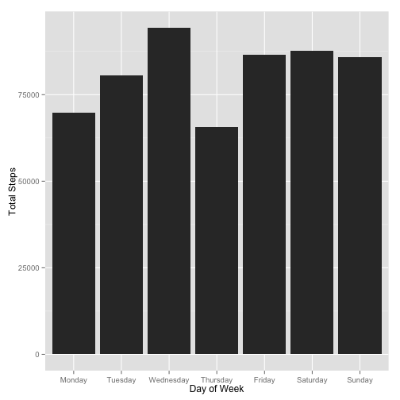
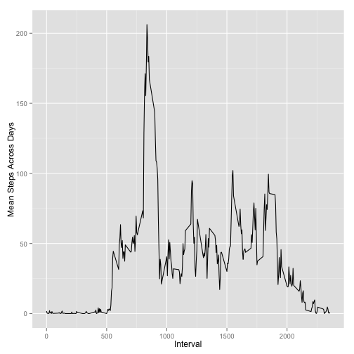
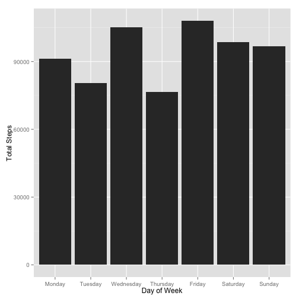
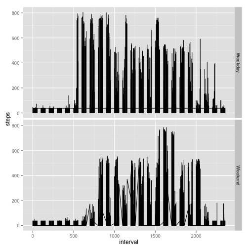

# Reproducible Research: Peer Assessment 1

Fitbit, Nike Fuelband, Jawbone Up, and other devices are popular with people who want to monitor their personal activity level for one reason or another. 
Although lots of data are collected, these data are not used much due to a lack
of statictical methods and software for processing and interpreting the data. 

## About the data
This assignment analyzes data from the personal activity monitoring  of an 
anonymous indivual. The data represents step activitly collected at 5 minute intervals through out the day, for October and November, 2012.

## Data variables
The variables in the activity.csv dataset are:
* steps: Number of steps taking in a 5-minute interval (missing values are 
coded as NA)
* date: The date on which the measurement was taken, in YYYY-MM-DD format
* interval: Identifier for the 5-minute interval in which measurement was taken

The dataset is stored in a comma-separated-value (CSV) file. There are a total 
of 17,568 observations.

## Loading and preprocessing the data
Make sure you set the working directlry correctly. After downloading the data.
read it into R. 

```r
activity <- read.csv("activity.csv",header=TRUE,sep=",", colClasses = "character")
```
Process and transform the data into a format suitable for analysis. For this 
part, remove the NA values. Then, change the interval and step data  numeric,
and the date data to the Date class.

```r
cleanAct <- na.omit(activity)
cleanAct$interval <- as.numeric(cleanAct$interval)
cleanAct$steps <- as.numeric(cleanAct$steps)
cleanAct$date <- as.Date(cleanAct$date,format='%Y-%m-%d')
```

Extract weekdays and bind them as a factor column to the cleaned dataset.

```r
dayOfWeek <- factor(weekdays(cleanAct$date), c("Monday","Tuesday",
                  "Wednesday","Thursday","Friday","Saturday","Sunday"))
cleanAct <- cbind(cleanAct,dayOfWeek)
```

Now the data is ready for plotting.

## What is mean total number of steps taken per day?
For this, use ggplot2. Make sure the package is loaded. To answer the question,
make a histogram of the total number of steps taken each day.

```r
library("ggplot2", lib.loc="/Library/Frameworks/R.framework/Versions/3.0/Resources/library")

qplot(dayOfWeek,data=cleanAct, geom="bar", weight=steps, 
         ylab = "Steps",xlab="Day of Week")
```

 

To calculate the mean and median total number of steps taken per day, load the plyr package and use ddply.

```r
library("plyr", lib.loc="/Library/Frameworks/R.framework/Versions/3.0/Resources/library")

ddply(cleanAct, "dayOfWeek", summarize, Mean_Steps = mean(steps))
```

```
##   dayOfWeek Mean_Steps
## 1    Monday      34.63
## 2   Tuesday      31.07
## 3 Wednesday      40.94
## 4  Thursday      28.52
## 5    Friday      42.92
## 6  Saturday      43.53
## 7    Sunday      42.63
```

```r
ddply(cleanAct, "dayOfWeek", summarize, Median_Steps = median(steps))
```

```
##   dayOfWeek Median_Steps
## 1    Monday            0
## 2   Tuesday            0
## 3 Wednesday            0
## 4  Thursday            0
## 5    Friday            0
## 6  Saturday            0
## 7    Sunday            0
```

## What is the average daily activity pattern?
To answer this question, use ggplot to make a time series plot of the 5-minute interval (x-axis) and the average number of steps taken, averaged across all days 
(y-axis).

```r
ggplot(cleanAct,aes(x=interval,y=steps)) + geom_line()
```

 

To find out which 5-minute interval, on average across all the days in the 
dataset, contains the maximum number of steps, you must first calculate the max 
for each interval.

```r
 maxStepsByInterval <- ddply(cleanAct, "interval", summarize, Max_Steps = max(steps))
```

Then, find the maximum of the Max_Steps Column and retrieve the associated 
interval by getting the index, then getting the time interval assodiated wiht 
that index.

```r
theMax <- max(maxStepsByInterval$Max_Steps)
theIndex <- match(theMax,maxStepsByInterval$Max_Steps)
theInterval <- maxStepsByInterval[theIndex,"interval"]
```

## Imputing missing values
Calculate and report the total number of missing values in the dataset
(i.e. the total number of rows with NA values).  Fill in missing values.
The strategy here is to use the mean.(There are other strategies like using the 
nearest value.) 

```r
numNA <- nrow(activity) - nrow(cleanAct)
meanSteps <- mean(as.numeric(activity$steps),na.rm=TRUE)
filledAct <- activity
filledAct$steps[is.na(filledAct$steps)]<-meanSteps
```

Create a new dataset with the filled in data in it. These are all the same
steps used to answer previous questions, but using the filleAct dataset.

```r
filledAct$interval <- as.numeric(filledAct$interval)
   filledAct$steps <- as.numeric(filledAct$steps)
   filledAct$date <- as.Date(filledAct$date,format='%Y-%m-%d')
   dayOfWeek <- factor(weekdays(filledAct$date), c("Monday","Tuesday",
                                                 "Wednesday","Thursday","Friday","Saturday","Sunday"))
   filledAct <- cbind(filledAct,dayOfWeek)
```

Make a histogram of the total number of steps taken each day.


```r
qplot(dayOfWeek,data=filledAct, geom="bar", weight=steps, 
         ylab = "Steps",xlab="Day of Week")
```

 

Calculate and report the mean and median total number of steps taken per day.


```r
ddply(filledAct, "dayOfWeek", summarize, Mean_Steps = mean(steps))
```

```
##   dayOfWeek Mean_Steps
## 1    Monday      35.25
## 2   Tuesday      31.07
## 3 Wednesday      40.54
## 4  Thursday      29.50
## 5    Friday      41.69
## 6  Saturday      42.76
## 7    Sunday      41.97
```

```r
ddply(filledAct, "dayOfWeek", summarize, Median_Steps = median(steps))
```

```
##   dayOfWeek Median_Steps
## 1    Monday            0
## 2   Tuesday            0
## 3 Wednesday            0
## 4  Thursday            0
## 5    Friday            0
## 6  Saturday            0
## 7    Sunday            0
```

## Are there differences in activity patterns between weekdays and weekends?
To answer this question, create a new factor variable in the dataset with two 
levels – “weekday” and “weekend” indicating whether a given date is a weekday 
or weekend day. To create the factor, use a conditional an for loop to iterate
over the the dayOfWeek factor. Createthe factor, then bind it to the filledAct
dataset.

```r
 weekendFactor = c()
   for (i in 1:nrow(filledAct)){
       if ((filledAct[i,"dayOfWeek"] == "Saturday") || (filledAct[i,"dayOfWeek"] == "Sunday")){
           weekendFactor[i] <- "Weekend"
       } else {
           weekendFactor[i] <- "Weekday"
       }
   }
   weekEndOrDay <- factor(weekendFactor)
   filledAct <- cbind(filledAct,weekEndOrDay)
```

Make a panel plot containing a time series plot of the 5-minute interval 
(x-axis) and the average number of steps taken, averaged across all weekday 
days or weekend days (y-axis). 

```r
qplot(interval,steps,data=filledAct, geom="line") + facet_grid(weekEndOrDay~.)
```

 
